# ⚡ SentinAI: Autonomous AI Security Circuit Breaker & Threat Oracle

[](https://opensource.org/licenses/MIT)
[](https://docs.genlayer.com)
[](https://github.com/genlayerlabs)
[](#-test-suite--verification)

**SentinAI** is a decentralized, autonomous security primitive and real-time threat oracle built natively on GenLayer. It empowers DeFi protocols, lending markets, and asset vaults with **automated AI circuit-breaker protection triggered by decentralized validator consensus over live security advisories and exploit traces**.

---

## 🎯 The Web3 Security Problem & GenLayer Solution

DeFi protocols and DAOs lose billions annually to flash loans, reentrancy vulnerabilities, and governance hijackings. While security researchers, bots, and firms (e.g. PeckShield, CertiK, GitHub Advisories) rapidly post exploit alerts off-chain, **standard EVM smart contracts cannot read the live web** to react.

**SentinAI bridges this critical gap on GenLayer**:
1. **Live Security Intelligence Grounding (`gl.nondet.web.get`)**: Validators independently fetch real-time vulnerability advisories, exploit PoCs, and transaction traces directly from the web.
2. **Multi-Validator Neural Consensus (`gl.vm.run_nondet_unsafe`)**: Validators analyze threat impact, target address correlation, and exploit severity under the **Equivalence Principle** with bound canonical action decisions and strict threshold boundaries.
3. **Automated On-Chain Circuit Breaker (`IPausableVault.emit().pause()`)**: When a `CRITICAL` or `HIGH` exploit is verified, SentinAI deterministically emits an external cross-contract call to pause the victim vault on finality, protecting user funds before catastrophic drainage.
4. **Incentive & Anti-Spam Game Theory**:
   - Whitehats receive an automatic **25% bounty payout** from the vault's bounty pool + stake refund.
   - Spam or false-alarm reports have their **1 GEN stake slashed** directly into the protocol's bounty reserve.

---

## 🏛️ Canonical Thresholds & Non-Crossing Boundary Consensus

To eliminate ambiguous consensus outcomes around critical thresholds (e.g. preventing a 79 score from validating an 85 score across the pause threshold), SentinAI enforces **Canonical Action Decisions**:

| Canonical Action Decision | Validation Criteria | On-Chain Execution |
|---|---|---|
| **`EMERGENCY_PAUSE`** | `threat_level in ["CRITICAL", "HIGH"]` AND `confidence_score >= 80` | Emits `pause()` cross-contract call to vault; releases 25% bounty + stake refund |
| **`DISMISS_SPAM`** | `threat_level == "FALSE_POSITIVE"` | Slashes 1 GEN anti-spam stake directly into vault bounty pool |
| **`INCONCLUSIVE_REFUND`** | Non-critical / sub-threshold (`confidence_score < 80`) | Safely refunds 1 GEN reporter stake; vault uptime preserved |

### Key Consensus Guarantees:
- **Strict Canonical Action Equality**: Both leader and validators must agree on the exact categorical action (`lead_action == val_action`).
- **Non-Crossing Boundary Constraint**: A validator strictly rejects if the leader and validator confidence scores cross the 80% boundary (i.e. `(l_conf >= 80) == (v_conf >= 80)` must hold).
- **Threshold-Bounded Tolerance**: Within the same threshold bucket, numeric confidence scores must agree within **`±6 points`**.

---

## 🏛️ System Architecture

```mermaid
sequenceDiagram
    autonumber
    actor Protocol as 🏦 Protocol Owner
    participant SentinAI as ⚡ SentinAI (GenVM)
    actor Whitehat as 🧑‍💻 Security Researcher
    participant Validators as ⚖️ GenLayer Validators (Optimistic Democracy)
    participant Web as 🌐 Security Intelligence (CertiK / GHSA)
    participant Vault as 🔒 Target DeFi Vault

    Protocol->>SentinAI: register_vault(vaultAddress) + deposit bounty
    Whitehat->>SentinAI: report_threat(vaultAddress, evidenceUrl, summary) + 1 GEN stake

    rect rgb(15, 23, 42)
        Note over SentinAI,Validators: Non-Deterministic Multi-Validator Consensus
        Validators->>Web: gl.nondet.web.get(evidenceUrl)
        Validators->>Validators: gl.nondet.exec_prompt(Exploit & Threat Classification)
        Validators->>Validators: Equivalence Principle Check (Canonical Decision Equality & Non-Crossing Threshold)
    end

    alt Emergency Pause Triggered (CRITICAL/HIGH & Conf >= 80)
        SentinAI->>Vault: emit().pause() [CIRCUIT BREAKER ACTIVATED]
        SentinAI->>Whitehat: emit_transfer(bounty_reward + stake_refund)
    else False Positive / Spam
        SentinAI->>SentinAI: slash_stake() -> added to vault bounty pool
    else Inconclusive / Non-Critical
        SentinAI->>Whitehat: emit_transfer(stake_refund)
    end
```



---

## 📁 Repository Structure

```
sentinai-circuit-breaker/
├── contracts/
│   └── sentinai.py            # Core Intelligent Contract on GenVM
├── tests/
│   └── direct/
│       └── test_sentinai.py   # Direct in-memory VM test suite
├── client.ts                  # TypeScript GenLayer client integration bindings
├── package.json               # genlayer-js & development dependencies
├── requirements.txt           # Python dependencies (genlayer-test, genvm-linter)
└── README.md                  # Complete architectural & technical documentation
```

---

## 💻 GenLayer Client Integration (`client.ts`)

```typescript
import { getGenLayerClient, registerVault, reportThreat, getVault, getThreatReport } from './client';

const client = getGenLayerClient('0xYourPrivateKey...');
const contractAddress = '0x74e9242C875fcdd048E5BaB671902A29A5ddBA3c';

// 1. Register Vault with 50 GEN bounty pool
const tx1 = await registerVault(client, contractAddress, '0xVaultAddress...', 50);

// 2. Whitehat reports threat with 1 GEN anti-spam stake
const tx2 = await reportThreat(client, contractAddress, '0xVaultAddress...', 'https://github.com/advisories/GHSA-...', 'Critical reentrancy PoC');

// 3. Query Finalized Report
const report = await getThreatReport(client, contractAddress, 0);
console.log(`Action: ${report.action_decision}, Level: ${report.threat_level}, Confidence: ${report.confidence_score}%`);
```

---

## 🧪 Test Suite & Verification

```bash
pytest tests/direct/ -v
```

### Verified Test Scenarios:
1. `test_critical_threat_adjudication_and_circuit_breaker`:
   - Vault registers with 40 GEN bounty pool.
   - Whitehat submits valid GitHub security advisory for target contract.
   - Validators reach consensus on `CRITICAL` threat with `EMERGENCY_PAUSE` (conf: 96).
   - Target vault is emergency paused; 10 GEN bounty (25% pool) + 1 GEN stake refund is distributed.
2. `test_false_positive_stake_slashing`:
   - Spam report is classified as `FALSE_POSITIVE` (`DISMISS_SPAM`).
   - Vault uptime remains unperturbed; 1 GEN spam stake is slashed into bounty pool.
3. `test_unauthorized_resume_protection`:
   - Non-owner attempts to resume vault are reverted.
   - Owner successfully unpauses after patch remediation.

---

## 📄 License

MIT © [Lesnak1](https://github.com/Lesnak1) & GenLayer Community
