# ⚡ SentinAI: Autonomous AI Security Circuit Breaker & Threat Oracle

[](https://opensource.org/licenses/MIT)
[](https://docs.genlayer.com)
[](https://github.com/genlayerlabs)
[](#-test-suite--verification)

**SentinAI** is a decentralized, autonomous security primitive and real-time threat oracle built natively on GenLayer. It empowers DeFi protocols, lending markets, and asset vaults with **automated AI circuit-breaker protection triggered by decentralized validator consensus over live security advisories and exploit traces**.

---

## 🎯 The Web3 Security Problem

DeFi protocols and DAOs lose billions annually to flash loans, reentrancy vulnerabilities, and governance hijackings. While security researchers, bots, and firms (e.g. PeckShield, CertiK, GitHub Advisories) rapidly post exploit alerts off-chain, **standard EVM smart contracts cannot read the live web** to react.

**SentinAI bridges this critical gap on GenLayer**:
1. **Live Security Intelligence Grounding (`gl.nondet.web.get`)**: Validators independently fetch real-time vulnerability advisories, exploit PoCs, and transaction traces directly from the web.
2. **Multi-Validator Neural Consensus (`gl.vm.run_nondet_unsafe`)**: Validators analyze threat impact, target address correlation, and exploit severity under the **Equivalence Principle** (strict tier matching and ±6 pt confidence tolerance).
3. **Automated On-Chain Circuit Breaker (`IPausableVault.emit().pause()`)**: When a `CRITICAL` or `HIGH` exploit is verified, SentinAI deterministically emits an external cross-contract call to pause the victim vault on finality, protecting user funds before catastrophic drainage.
4. **Incentive & Anti-Spam Game Theory**:
   - Whitehats receive an automatic **25% bounty payout** from the vault's bounty pool + stake refund.
   - Spam or false-alarm reports have their **1 GEN stake slashed** directly into the protocol's bounty reserve.

---

## 🏛️ System Architecture

```mermaid
sequenceDiagram
    autonumber
    actor Protocol as 🏦 Protocol Owner
    participant SentinAI as ⚡ SentinAI (GenVM)
    actor Whitehat as 🧑‍💻 Security Researcher
    participant Validators as ⚖️ GenLayer Validators (Optimistic Democracy)
    participant Web as 🌐 Security Intelligence (CertiK / GHSA)
    participant Vault as 🔒 Target DeFi Vault

    Protocol->>SentinAI: register_vault(vaultAddress) + deposit bounty
    Whitehat->>SentinAI: report_threat(vaultAddress, evidenceUrl, summary) + 1 GEN stake

    rect rgb(15, 23, 42)
        Note over SentinAI,Validators: Non-Deterministic Multi-Validator Consensus
        Validators->>Web: gl.nondet.web.get(evidenceUrl)
        Validators->>Validators: gl.nondet.exec_prompt(Exploit & Threat Classification)
        Validators->>Validators: Equivalence Principle Check (Strict Tier Match & ±6 pt tolerance)
    end

    alt Critical Threat Verified (Confidence >= 80)
        SentinAI->>Vault: emit().pause() [CIRCUIT BREAKER ACTIVATED]
        SentinAI->>Whitehat: emit_transfer(bounty_reward + stake_refund)
    else False Positive / Spam
        SentinAI->>SentinAI: slash_stake() -> added to vault bounty pool
    end
```



---

## 🔬 Multi-Validator Equivalence Principle

SentinAI implements a robust custom consensus pair (`leader_fn`, `validator_fn`) via `gl.vm.run_nondet_unsafe`:

| Assessment Metric | Validation Requirement |
|---|---|
| **Threat Level** | Must match exact tier (`CRITICAL`, `HIGH`, `MEDIUM`, `LOW`, `FALSE_POSITIVE`) |
| **Emergency Action** | Both leader and validator must agree on binary `should_pause` verdict |
| **Confidence Score** | Numeric tolerance within **`±6 points`** (0–100 scale) |
| **Target Address Match** | Verified against target contract address in report payload |

---

## 💻 Integration Guide for DeFi Protocols

Any Solidity / EVM contract or GenLayer Intelligent Contract can integrate SentinAI protection with standard OpenZeppelin `Pausable`:

```solidity
// SPDX-License-Identifier: MIT
pragma solidity ^0.8.20;

import "@openzeppelin/contracts/utils/Pausable.sol";

contract ProtectedVault is Pausable {
    address public immutable sentinAIOracle;

    modifier onlySentinelOrOwner() {
        require(msg.sender == sentinAIOracle || msg.sender == owner(), "Unauthorized");
        _;
    }

    function pause() external onlySentinelOrOwner {
        _pause();
    }

    function unpause() external onlyOwner {
        _unpause();
    }
}
```

---

## 🧪 Test Suite & Verification

The repository includes direct in-memory VM tests (`pytest`) validating all critical workflows:

```bash
pytest tests/direct/ -v
```

### Verified Test Scenarios:
1. `test_critical_threat_adjudication_and_circuit_breaker`:
   - Vault registers with 40 GEN bounty pool.
   - Whitehat submits valid GitHub security advisory for target contract.
   - Validators reach consensus on `CRITICAL` threat (conf: 96).
   - Target vault is emergency paused; 10 GEN bounty (25% pool) + 1 GEN stake refund is distributed.
2. `test_false_positive_stake_slashing`:
   - Spam report is classified as `FALSE_POSITIVE`.
   - Vault uptime remains unperturbed; 1 GEN spam stake is slashed into bounty pool.
3. `test_unauthorized_resume_protection`:
   - Non-owner attempts to resume vault are reverted.
   - Owner successfully unpauses after patch remediation.

---

## 📄 License

MIT © [Lesnak1](https://github.com/Lesnak1) & GenLayer Community
